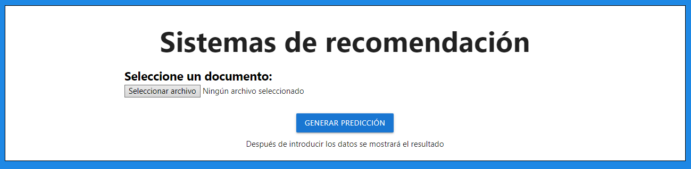

<a name="item0"></a>
# Sistemas de recomendación. Modelos Basados en el Contenido

#### Autor: Daniel Álvarez Medina
#### Correo: alu0101216126@ull.edu.es
#### [Acceda al sistema de recomendación](https://alu0101216126.github.io/CB-RecommenderSystem/)

## Índice 

* [Introducción](#item1)
* [Directorios](#item2)
* [Instrucciones](#item3)

  * [Ejemplo de uso](#item3.1)
 
* [Descripción del código](#item4)

  * [index.html](#item4.1) 
  * [form.js](#item4.2)
  * [recommender.js](#item4.3) 

<a name="item1"></a>
## 1. Introducción :rocket:

Implementación de un sistema de recomendación siguiendo el sistema de Modelos Basados en el Contenido.

La práctica se ha llevado a cabo en el lenguaje **Javascript**. A su vez, la pedida de datos la hemos realizado en HTML y procesado posteriormente en Javascript.
Cabe destacar que para dar estilo al HTML, empleamos hojas de estilo **CSS**, y también las proporcionadas por el framework de CSS [Materialize](https://materializecss.com).

[↑](#item0)

<a name="item2"></a>
## 2. Directorios :file_folder:

Si accedemos al directorio [/docs](https://github.com/alu0101216126/CB-RecommenderSystem/tree/main/docs), encontraremos una organización como la siguiente:

* [/css](https://github.com/alu0101216126/CB-RecommenderSystem/tree/main/docs/css): Directorio que contiene las hojas de estilo empleadas. 
  * [style.css](https://github.com/alu0101216126/CB-RecommenderSystem/blob/main/docs/css/style.css): Hoja de estilo para el archivo [index.html](https://github.com/alu0101216126/CB-RecommenderSystem/blob/main/docs/index.html)

* [/examples](https://github.com/alu0101216126/CB-RecommenderSystem/tree/main/docs/examples): Directorio que contiene una serie de matrices de utilidad de ejemplo para introducir en el sistema de recomendación.
  * [documents-01.txt](https://github.com/alu0101216126/CB-RecommenderSystem/blob/main/docs/examples/documents-01.txt): Fichero que contiene un documento por línea.
  * [documents-02.txt](https://github.com/alu0101216126/CB-RecommenderSystem/blob/main/docs/examples/documents-02.txt): Fichero que contiene un documento por línea.
  * [documents-03.txt](https://github.com/alu0101216126/CB-RecommenderSystem/blob/main/docs/examples/documents-03.txt): Fichero que contiene un documento por línea.

* [/media](https://github.com/alu0101216126/CB-RecommenderSystem/tree/main/media): Directorio que contiene imágenes y gifs empleados en el README.md.
* [/src](https://github.com/alu0101216126/CB-RecommenderSystem/tree/main/docs/src): Directorio que contiene los scripts empleados para llevar a cabo el sistema de recomendación
  * [form.js](https://github.com/alu0101216126/CB-RecommenderSystem/blob/main/docs/src/form.js): Procesamos los datos obtenidos en el formulario, y mediante un objeto de la clase **Recommender**, obtenemos y mostramos los resultados.
  * [recommender.js](https://github.com/alu0101216126/CB-RecommenderSystem/blob/main/docs/src/recommender.js): Contiene la clase **Recommender**, dicha clase almacena los datos obtenidos en el formulario y realiza los cálculos correspondientes para obtener la matriz de similitud coseno entre los distintos documentos, y por cada documento, obtener para cada de sus palabras: TF, IDF, TF-IDF.
* [index.html](https://github.com/alu0101216126/CB-RecommenderSystem/blob/main/docs/index.html): Fichero **HTML** que contiene el formulario a procesar mediante el fichero [form.js](https://github.com/alu0101216126/CB-RecommenderSystem/blob/main/docs/src/form.js)

[↑](#item0)

<a name="item3"></a>
## 3. Instrucciones :page_with_curl:

Para acceder al sistema recomendador lo haremos a través del enlace que aparece en la parte superior, o haciendo clic [aquí](https://alu0101216126.github.io/CB-RecommenderSystem/).



Veremos que tenemos un formulario con una serie de campos (fichero index.html):

* En primer lugar, se nos indica que seleccionemos un documento. Dicho documento lo debemos de subir en formato `.txt`, al pusar el botón de **Seleccionar arhivo**. En [/examples](https://github.com/alu0101216126/CB-RecommenderSystem/tree/main/docs/examples) podemos encontrar algunos ficheros de ejemplo. Se aprecia que cada fila representará un documento distinto.

Posteriormente, pulsaremos el botón de **GENERAR PREDICCIÓN** para mostrar los resultados, los cuales son: 

* Para cada documento, una tabla con las siguientes columnas:

  * Índice del término.
  * Término.
  * TF.
  * IDF.
  * TF-IDF.
  
* Tabla que muestra la similaridad coseno entre cada par de documentos.

<a name="item3.1"></a>
### 3.1 Ejemplo de uso 

Un ejemplo de ejecución sería el siguiente:

<p align="center">
 <a href="https://github.com/alu0101216126/CB-RecommenderSystem/blob/main/media/Example.gif">
  
 </a>
</p>

[↑](#item0)

<a name="item4"></a>
## 4. Descripción del código :computer:

<a name="item4.1"></a>
### 4.1. index.html 

El fichero [index.html](https://github.com/alu0101216126/CB-RecommenderSystem/blob/main/docs/index.html), contiene el formulario a rellenar por parte del usuario, donde posteriormente será analizado.

La información del contenido de este fichero lo puede encontrar en las [Instrucciones](#item3). 

[↑](#item0)

<a name="item4.2"></a>
### 4.2. form.js

En [form.js](https://github.com/alu0101216126/CB-RecommenderSystem/blob/main/docs/src/form.js), procesamos los datos obtenidos en el formulario, para posteriormente almacenarlos en variables, y mediante un objeto de la clase **Recommender**, obtener y mostrar los resultados.

Para esto, primeramente, creamos un objeto de la clase Recommender que explicaremos más adelante. Lo llamaremos **recommender**:
```javascript
const recommender = new Recommender();
```
Una vez creado el objeto, podremos trabajar con los eventos para procesar y mostrar datos. Para conseguir esto, empleamos dos tipos de eventos:

* Evento `change`: Este evento se activará cada vez que el input del campo que estamos observando cambie.

```javascript
const fileInput = document.getElementById('documents');
fileInput.addEventListener('change', fileToDocuments);
```
Se puede observar en el ejemplo, que lo que haremos será obtener el campo que queremos analizar, que en este caso es el archivo .txt con los documentos a analizar. Posteriormente, cuando se active el evento, llamaremos al método `fileToDocuments`:

```javascript
    function fileToDocuments(e) {

    // Manejo de errores
    if (e.target.files.length < 1) {
      alert("Tienes que subir un fichero de documentos");
    }

    const file = fileInput.files[0];
    let reader = new FileReader();
    reader.readAsText(file);

    reader.onload= function() { 
        // Cada línea del fichero se guarda en un array
        let lines = reader.result.split('\n');

        // Formalizamos los documentos
        for (let i = 0; i < lines.length; i++) {

            if (lines[i] == '') { 
                lines.splice(i, 1); 
                continue;  
            }

            lines[i] = lines[i].trim(); // Eliminamos los caracteres en blanco al principio y al final de la línea
            lines[i] = lines[i].replace(/[^a-zA-Z0-9\s\']/g, ''); // ^ = Negación -> Eliminamos aquellos caracteres que no sean letras, números o espacios.
            lines[i] = lines[i].replace(/\s+/g, ' '); // Reemplazamos los espacios dobles por uno solo  
            lines[i] = lines[i].toLowerCase(); // Convertimos a minúsculas
            
            // Por cada línea, separamos por espacios	
            lines[i] = lines[i].split(' ');
            console.log(lines[i]);
        }

        // Asignamos los documentos a la matriz de documentos de la clase Recomendador
        recommender.setDocuments(lines);
    }

}
```
En el método `fileToDocuments`, creamos un objeto de la clase `FileReader()` que denominaremos `reader`. Una vez hecho esto, leemos el fichero recibido como texto.

Cuando se acabe de leer el fichero correctamente, se activará el evento `load`. En este evento, separamos el archivo recibido por líneas, donde cada línea representará un documento. Por cada línea: convertimos el texto a minúsculas, eliminamos caracteres que no sean alfanuméricos, eliminamos espacios innecesarios, y separamos cada línea por espacios. Finalmente, esta matriz de documentos se almacenará en el objeto recommender a través del método `setDocuments(lines)`.

* Evento `click`: Este evento se activará cada vez que pulsemos el botón del campo que estamos observando.

```javascript
const generate = document.getElementById('generate');
generate.addEventListener('click', function(e) {
```
Se puede observar en el ejemplo, que lo que haremos será obtener el campo que queremos analizar, que en este caso es el botón a pulsar. Posteriormente, cuando se active el evento, lo que haremos será realizar todos los cálculos necesarios con los valores almacenados hasta el momento, para finalmente mostrarlos.

También existen otros métodos que simplemente se encargar de mostrar mediante HTML los resultados, estos son: `showResults(documents, tf, idf, tf_idf)`, `printTables(tf, idf, tf_idf)` y `showPredictionsCalculation(array, prediction)`.

[↑](#item0)

<a name="item4.3"></a>
### 4.3. recommender.js

El fichero [recommender.js](https://github.com/alu0101216126/CB-RecommenderSystem/blob/main/docs/src/recommender.js), contiene la clase **Recommender**, dicha clase almacena los datos obtenidos en el formulario y realiza los cálculos correspondientes para obtener la matriz de similitud coseno entre los distintos documentos, y por cada documento, obtener para cada de sus palabras: TF, IDF, TF-IDF.

* [Constructor](#Constructor)
* [Setter](#Setter)
* [Getters](#Getters)
* [calculateTF()](#calculateTF)
* [calculateIDF()](#calculateIDF)
* [calculateTFIDF()](#calculateTFIDF)
* [calculateVectorLength()](#calculateVectorLength)
* [calculateNormalizedTF()](#calculateNormalizedTF)
* [cosineSimilarity()](#cosineSimilarity)
* [calculateSimilarityMatrix](#calculateSimilarityMatrix)

<a name="Constructor"></a>
### **_Constructor_**

El constructor por defecto de la clase es el siguiente:

```javascript
constructor() {
        this.documents = [];
        this.TF = [];
        this.IDF = [];
        this.TFIDF = [];
        this.similarityMatrix = [];
        this.vectorLength = [];
        this.normalizedTF = [];
      }
```
Como los valores de los atributos cambian dinámicamente mediante el evento explicado `click`, todos los atributos tendrán valores por defecto hasta que estos cambien.

* `this.documents`: Representa una matriz de documentos. Cada documento es una lista de palabras.
* `this.TF`: Representa un array de frecuencias de cada palabra en cada documento.
* `this.IDF`: Representa un array de frecuencias inversas de cada palabra en cada documento.
* `this.TFIDF`: Array numérico que expresa cuán relevante es una palabra para un documento en una colección.
* `this.similarityMatrix`: Matriz de similitud coseno entre documentos.
* `this.vectorLength`: Array de longitud de cada documento.
* `this.normalizedTF`: Array de frecuencias normalizadas de cada palabra en cada documento.

[↑](#item0)

<a name="Setter"></a>
### **_Setter_**

Mediante los setters, podemos establecer los valores de los atributos, en este caso sólo contamos con un setter:

* `setDocuments(documents)`: Establecemos la matriz de documentos.

[↑](#item0)

<a name="Getters"></a>
### **_Getters_**

Asimismo, también contamos con una serie de getters que nos devuelven los valores de algunos atributos.

* `getDocuments()`: Devuelve la matriz de documentos.
* `getTF()`: Devuelve la matriz de términos más frecuentes de cada documento.
* `getIDF()`: Devuelve la matriz IDF.
* `getTFIDF()`: Devuelve la matriz TFIDF.
* `getSimilarityMatrix()`: Devuelve la matriz de similitud.
* `getVectorLength()`: Devuelve el vector de longitud de cada documento.

[↑](#item0)

<a name="calculateTF"></a>
### **_calculateTF()_**

Con este método calculamos cómo de habitual es un término en su documento correspondiente, denominado TF. Aquellos términos más relevantes, son aquellos que más aparecen, es decir, tienen un TF mayor.

```javascript
calculateTF() {
        let TF = [];
        for (let i = 0; i < this.documents.length; i++) {
            let docTF = {};

            for (let j = 0; j < this.documents[i].length; j++) {
                let word = this.documents[i][j];
                if (docTF[word]) docTF[word]++;
                else docTF[word] = 1;
            }

            TF.push(docTF);
        }

        this.TF = TF;
    }
```
En primer lugar crearemos un vector que almacenará los resultados (TF). Trabajaremos a su vez con objetos, por lo que obtendremos como resultado, una matriz de objetos de la siguiente manera:

* `[{palabra1: frecuencia1, palabra2: frecuencia2, ...}, {palabra1: frecuencia1, palabra2: frecuencia2, ...}, ...]`

A continuación recorreremos la matriz de documentos, donde por cada documento, contaremos cuantas veces se repite cada palabra.

* Si la palabra ya existe, incrementamos su frecuencia.
* Si la palabra actual no se encuentra todavía en el documento, es que es la primera vez que aparece, por lo que se le asigna una frecuencia de 1.

Después de haber recorrido toda la matriz de documentos, asignamos al atributo TF, el resultado que hemos obtenido.

[↑](#item0)

<a name="calculateIDF"></a>
### **_calculateIDF()_**

Mediante este método obtenemos el IDF o frecuencia inversa de cada palabra en su documento correspondiente. Debemos de seguir la siguiente fórmula: `IDF(x) = log N/dfx`

```javascript
calculateIDF() {
        let IDF = [];
        let N = this.documents.length;
        let dfx = 0; // Número de documentos en N en los que la palabra clave x aparece.

        // Por cada fila de TF, Comprobamos si la palabra aparece en algún documento
        for (let i = 0; i < this.TF.length; i++) {
            let docIDF = {};

            for (let word in this.TF[i]) {
                dfx = 0;
                for (let j = 0; j < this.documents.length; j++) {
                    if (this.documents[j].includes(word)) dfx++;
                }
                docIDF[word] = Math.log10(N / dfx);
            }

            IDF.push(docIDF);
        }
        this.IDF = IDF;
    }
```
En primer lugar definimos las variables que vamos a emplear:
* **IDF**: array donde iremos almacenando el resultado.
* **N**: tamaño de la matriz de documentos.
* **dfx**: número de documentos en N en los que la palabra clave x aparece.

Cabe destacar que trabajaremos a su vez con objetos (docIDF), por lo que obtendremos como resultado, una matriz de objetos de la siguiente manera:

* `[{palabra1: IDF1, palabra2: IDF2, ...}, {palabra1: IDF1, palabra2: IDF2, ...}, ...]`
* 
Ahora, por cada fila del atributo TF, comprobamos si la palabra que estamos analizando aparece en algún documento. Si es así, incrementamos el contador dfx.

Una vez tenemos el valor de dfx, podemos calcular el IDF para la palabra del documento actual, aplicando la siguiente fórmula: `IDF(x) = log N/dfx`

* `docIDF[word] = Math.log10(N / dfx);`

Vamos almacenando los resultados, para finalmente, asignar el array IDF en el atributo de la clase.

[↑](#item0)

<a name="calculateTFIDF"></a>
### **_calculateTFIDF()_**

En este método obtenemos el valor TFIDF de cada palabra en su documento correspondiente.

```javascript
calculateTFIDF() {
        let TFIDF = [];
        for (let i = 0; i < this.TF.length; i++) {
            let docTFIDF = {};

            for (let word in this.TF[i]) {
                docTFIDF[word] = this.TF[i][word] * this.IDF[i][word];
            }

            TFIDF.push(docTFIDF);
        }

        this.TFIDF = TFIDF;
    }
```
En primer lugar definimos el array **TFIDF**, el cual ira almacenando los resultados obtenidos. Cabe destacar que trabajaremos a su vez con objetos (docTFIDF), por lo que obtendremos como resultado, una matriz de objetos de la siguiente manera:

* `[{palabra1: TFIDF1, palabra2: TFIDF2, ...}, {palabra1: TFIDF1, palabra2: TFIDF2, ...}, ...]`

Ahora, por cada fila del atributo TF, comprobamos si la palabra que estamos analizando aparece en algún documento. Si es así, aplicamos la fórmula: `TFIDF(x) = TF(x) * IDF(x)`

* `docTFIDF[word] = this.TF[i][word] * this.IDF[i][word];`

El resultado de estas operaciones se va almacenando en la variable TFIDF, para finalmente, asignar el array IDF en el atributo correspondiente de la clase.

[↑](#item0)

<a name="calculateVectorLength"></a>
### **_calculateVectorLength()_**

Con este método calculamos el vector de longitud de cada documento. 

```javascript
calculateVectorLength() {
        let vectorLength = [];
        for (let i = 0; i < this.TF.length; i++) {
            let docLength = 0;

            for (let word in this.TF[i]) {
                docLength += Math.pow(this.TF[i][word], 2);
            }

            vectorLength.push(Math.sqrt(docLength));
        }

        this.vectorLength = vectorLength;
    }
```
La longitud de estos vectores se calcula como la raíz cuadrada de la suma de los valores al cuadrado de cada atributo en el vector.

Tras realizar esta fórmula, obtendremos en el atributo **vectorLength**, un array con la longitud de cada documento.

[↑](#item0)

<a name="calculateNormalizedTF"></a>
### **_calculateNormalizedTF()_**

En este método normalizamos los TF de cada documento.

```javascript
calculateNormalizedTF() {
        this.calculateVectorLength();
        let normalizedTF = [];

        for (let i = 0; i < this.TF.length; i++) {
            let docNormalizedTF = {};
            for (let word in this.TF[i]) {
                docNormalizedTF[word] = this.TF[i][word] / this.vectorLength[i];
            }

            normalizedTF.push(docNormalizedTF);
        }

        this.normalizedTF = normalizedTF;
    }
```
Para ello debemos de dividir cada TF por la longitud de su documento correspondiente (vectorLength).

El resultado lo almacenaremos en el atributo **normalizedTF**. 

[↑](#item0)

<a name="cosineSimilarity"></a>
### **_cosineSimilarity(doc1, doc2)_**

Con este método calculamos la similitud de dos documentos usando el método de coseno.

```javascript
cosineSimilarity(doc1, doc2) {
        let similarity = 0;

        for (let word in doc1) {
            if (doc2[word]) similarity += doc1[word] * doc2[word];
        }

        return similarity;
    }
```
Para ello definimos un acumulador denominado **similarity**, el cual almacenará la suma de los productos, de aquellos TF normalizados donde sus palabras se encuentren en ambos documentos.

Lo primero que debemos hacer, es recorrer las palabras de **doc1**, si la palabra aparece en ambos documentos, sumamos el producto de sus TF normalizados.

* `if (doc2[word]) similarity += doc1[word] * doc2[word];`

Finalmente retornamos el sumatorio **similarity**, el cual contiene la similitud entre **doc1** y **doc2**

[↑](#item0)

<a name="calculateSimilarityMatrix"></a>
### **_calculateSimilarityMatrix()_**

En este último método, calculamos la matriz de similitud de cada documento con todos los demás.

```javascript
calculateSimilarityMatrix() {
        let similarityMatrix = [];

        for (let i = 0; i < this.normalizedTF.length; i++) {
            let docSimilarityMatrix = [];

            for (let j = 0; j < this.normalizedTF.length; j++) {
                docSimilarityMatrix.push(this.cosineSimilarity(this.normalizedTF[i], this.normalizedTF[j]));
            }

            similarityMatrix.push(docSimilarityMatrix);
        }
        this.similarityMatrix = similarityMatrix;
    }
```
**similarityMatrix** (variable) almacenará los resultados que formarán la matriz de similitud.
**docSimilarityMatrix** por cada iteración, almacenará los resultados de realizar la similitud del documento x, con el resto de documentos.

Ahora, lo que debemos hacer, es recorrer el array de TF normalizados (Recordar que cada elemento del array hace referencia a un documento), y por cada elemento de dicho array, realizar el método **cosineSimilarity()** con el resto de documentos. 

Estos resultados los iremos almacenando, hasta finalmente, asignar el resultado al atributo correspondiente **similarityMatrix**. De esta manera ya tendríamos la matriz de documentos.

[↑](#item0)
